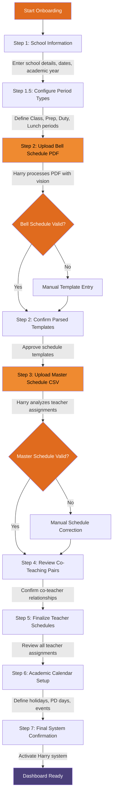

# Harry Llama Scheduler - System Onboarding Flow

**Target Audience:** Principals & Assistant Principals  
**Purpose:** Complete system setup and configuration process

This diagram shows the complete 7-step onboarding process that educational administrators follow to set up the Harry Llama Scheduler system for their school.

## Process Overview

The onboarding flow guides administrators through:
1. **School Information Setup** - Basic school details and academic calendar
2. **Period Type Configuration** - Class, Prep, Duty, and Lunch period definitions
3. **Bell Schedule Processing** - PDF upload with Harry's intelligent parsing
4. **Master Schedule Integration** - CSV upload with teacher assignment analysis
5. **Co-Teaching Relationship Confirmation** - Validating teaching partnerships
6. **Teacher Schedule Finalization** - Complete assignment review
7. **Academic Calendar Setup** - Holidays, PD days, and special events

## Mermaid Diagram

## Key Features

- **Automated Document Processing:** Harry uses advanced vision processing to extract bell schedule information from PDF documents
- **Intelligent Validation:** Each step includes validation checks to ensure data accuracy
- **Error Recovery:** Manual entry options available when automatic processing needs adjustment
- **Co-Teacher Detection:** Harry automatically identifies teaching partnerships from schedule data
- **Comprehensive Setup:** Complete system configuration in a guided, step-by-step process

## Benefits for Administrators

- **Time Savings:** Automated processing reduces setup time from days to hours
- **Accuracy:** Harry's analysis reduces human error in schedule interpretation
- **Flexibility:** Manual override options ensure system works with any school configuration
- **Completeness:** Guided process ensures no critical setup steps are missed