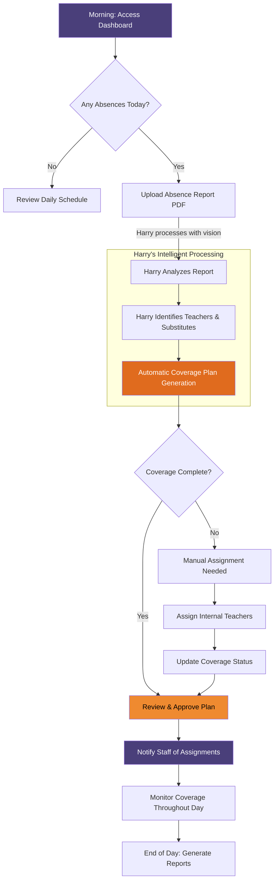

# Harry Llama Scheduler - Daily Scheduling Workflow

**Target Audience:** Principals & Assistant Principals  
**Purpose:** Morning routine and daily coverage management

This diagram illustrates the typical morning workflow that educational administrators follow when using the Harry Llama Scheduler system to manage daily operations and teacher coverage.

## Process Overview

The daily scheduling workflow includes:
1. **Morning Dashboard Review** - Quick overview of the day's schedule
2. **Absence Detection** - Checking for teacher absences
3. **Automated Report Processing** - Harry analyzes absence reports with vision
4. **Coverage Plan Generation** - Intelligent assignment of substitute coverage
5. **Administrative Review** - Final approval and adjustments
6. **Staff Communication** - Notifications to affected personnel
7. **Ongoing Monitoring** - Real-time coverage status tracking

## Mermaid Diagram

## Key Features

- **Vision-Powered PDF Processing:** Harry reads absence reports directly from PDF documents
- **Intelligent Teacher Recognition:** Automatic identification of absent teachers and available substitutes  
- **Smart Coverage Matching:** Harry considers teacher qualifications, availability, and preferences
- **Real-Time Updates:** Dashboard reflects current coverage status throughout the day
- **Automated Notifications:** Staff receive immediate updates about their assignments

## Benefits for Administrators

- **Streamlined Morning Routine:** Complete coverage planning in minutes instead of hours
- **Reduced Manual Work:** Automatic processing eliminates manual data entry
- **Improved Accuracy:** Harry's analysis reduces missed assignments and scheduling conflicts
- **Better Communication:** Automated notifications ensure all staff are informed promptly
- **Data-Driven Insights:** End-of-day reports provide valuable analytics for future planning

## Integration Points

- **Student Information System:** Harry can integrate with existing absence reporting systems
- **Communication Platforms:** Notifications can be sent via email, SMS, or school communication apps
- **Calendar Systems:** Daily schedules sync with school calendar platforms

<svg xmlns="http://www.w3.org/2000/svg" width="100%" height="100%" viewBox="0 0 800 600">
  
