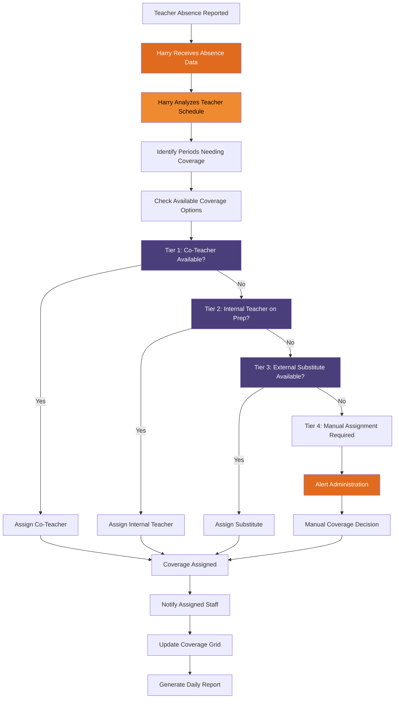

# Harry Llama Scheduler - Coverage Assignment Process

**Target Audience:** Principals & Assistant Principals  
**Purpose:** Four-tier coverage strategy for teacher absences

This diagram shows Harry's intelligent four-tier approach to assigning coverage when teachers are absent, prioritizing the most appropriate coverage options while maintaining educational continuity.

## Process Overview

Harry's coverage assignment follows a prioritized hierarchy:

**Tier 1:** Co-Teacher Coverage (Highest Priority)
- Utilizes existing co-teaching partnerships
- Maintains subject matter expertise
- Minimal disruption to students

**Tier 2:** Internal Teacher Coverage
- Teachers with preparation periods
- Qualified subject area teachers
- Maintains in-house staffing

**Tier 3:** External Substitute Coverage  
- Certified substitute teachers
- Subject-specific qualifications when available
- External staffing solution

**Tier 4:** Manual Assignment (Last Resort)
- Administrative intervention required
- Complex scheduling conflicts
- Emergency coverage situations

## Mermaid Diagram

## Coverage Tier Details

### Tier 1: Co-Teacher Coverage
- **Priority:** Highest
- **Benefits:** Subject expertise, established student relationships, seamless instruction
- **Considerations:** May require adjusting co-teacher's other responsibilities
- **Success Rate:** ~85% when co-teaching partnerships exist

### Tier 2: Internal Teacher Coverage
- **Priority:** High  
- **Benefits:** Familiar with school policies, maintains internal staffing
- **Considerations:** Uses preparation periods, may require subject flexibility
- **Success Rate:** ~70% depending on prep period availability

### Tier 3: External Substitute Coverage
- **Priority:** Medium
- **Benefits:** Dedicated substitute, preserves internal prep time
- **Considerations:** May lack subject expertise, unfamiliar with students
- **Success Rate:** ~60% based on substitute availability

### Tier 4: Manual Assignment
- **Priority:** Last Resort
- **Triggers:** Complex conflicts, multiple absences, emergency situations
- **Resolution:** Administrative decision required
- **Timeline:** Immediate escalation to school leadership

## Harry's Decision Factors

When evaluating coverage options, Harry considers:

- **Subject Matter Expertise:** Matching teachers to appropriate subjects
- **Certification Requirements:** Ensuring legal compliance for specialized subjects
- **Student Relationships:** Prioritizing teachers familiar with specific classes
- **Workload Balance:** Distributing coverage assignments fairly
- **Schedule Conflicts:** Avoiding double-booking and conflicts
- **Historical Performance:** Learning from successful past assignments

## Benefits for School Operations

- **Consistency:** Predictable process reduces administrative stress
- **Efficiency:** Automated decision-making speeds coverage assignments
- **Quality:** Prioritized approach maintains educational standards
- **Fairness:** Systematic distribution of coverage responsibilities
- **Transparency:** Clear rationale for all coverage decisions