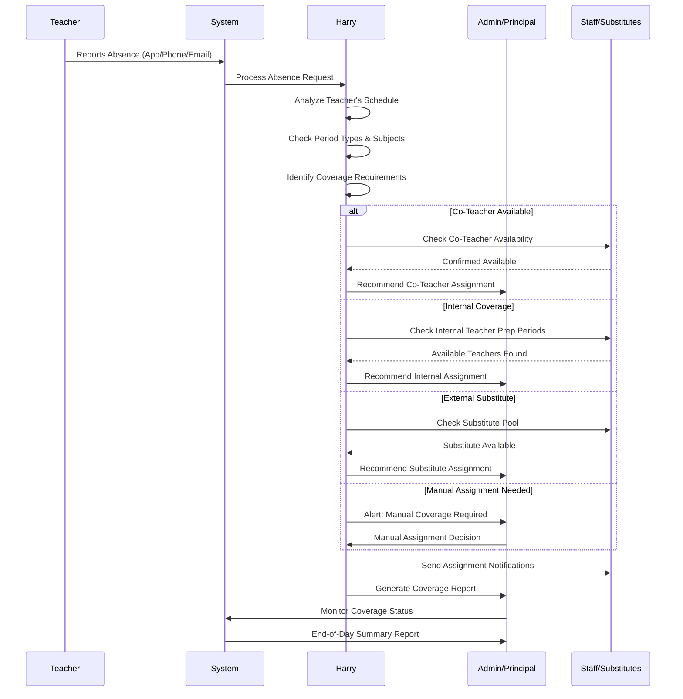

# Harry Llama Scheduler - Teacher Absence Management

**Target Audience:** Principals & Assistant Principals  
**Purpose:** Complete sequence of events from absence reporting to coverage confirmation

This sequence diagram shows the complete flow of communication and actions that occur when a teacher reports an absence, from initial notification through final coverage confirmation and reporting.

## Process Overview

The teacher absence management process involves multiple stakeholders:

- **Teachers:** Report absences through various channels
- **Harry System:** Processes absence data and generates coverage recommendations
- **Administration:** Reviews and approves coverage assignments
- **Staff/Substitutes:** Receive and confirm assignments
- **System:** Tracks status and generates reports

## Mermaid Diagram

## Communication Channels

### Absence Reporting Methods
- **Mobile App:** Real-time absence submission with instant confirmation
- **Phone System:** Automated voice system for after-hours reporting
- **Email Integration:** Direct email processing with natural language understanding
- **Web Portal:** Browser-based absence management interface

### Notification Systems
- **SMS/Text:** Immediate alerts for urgent coverage needs
- **Email:** Detailed assignment information and instructions
- **Push Notifications:** Mobile app alerts for real-time updates
- **Dashboard Alerts:** Visual indicators in the administrative interface

## Harry's Analysis Process

### Schedule Analysis Steps:
1. **Period Identification:** Determine which periods need coverage
2. **Subject Classification:** Identify academic subjects vs. prep/duty periods
3. **Special Requirements:** Note any certifications or qualifications needed
4. **Student Considerations:** Account for special needs or behavioral factors
5. **Historical Patterns:** Reference past successful coverage assignments

### Coverage Matching Algorithm:
- **Primary Match:** Subject area expertise and certification
- **Secondary Match:** Previous experience with specific classes
- **Tertiary Match:** General availability and workload balance
- **Fallback Match:** Emergency coverage with administrative support

## Status Tracking

The system maintains real-time status for all absence-related activities:

- **Reported:** Initial absence submission received
- **Processing:** Harry analyzing coverage requirements  
- **Pending:** Coverage recommendation awaiting approval
- **Assigned:** Coverage confirmed and notifications sent
- **Confirmed:** Staff acknowledgment of assignments received
- **Active:** Coverage currently in progress
- **Completed:** End-of-day resolution and reporting

## Benefits for School Operations

- **Rapid Response:** Automated processing reduces response time from hours to minutes
- **Comprehensive Coverage:** Ensures all periods are addressed without gaps
- **Clear Communication:** All stakeholders receive appropriate information promptly
- **Audit Trail:** Complete record of decisions and communications for accountability
- **Predictive Insights:** Historical data helps improve future coverage planning

## Error Handling and Edge Cases

- **Multiple Absences:** Harry can handle complex scenarios with multiple simultaneous absences
- **Last-Minute Changes:** Real-time updates when coverage plans need adjustment
- **Substitute No-Shows:** Automatic fallback procedures when assigned coverage fails
- **Emergency Situations:** Escalation protocols for urgent coverage needs