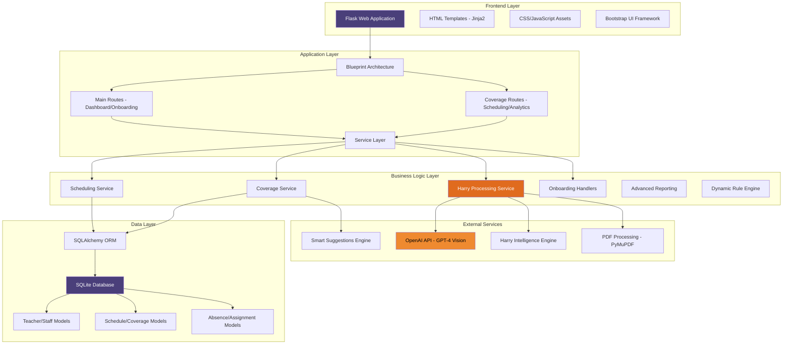

# Harry Llama Scheduler - System Architecture Overview

**Target Audience:** IT Department  
**Purpose:** Technical infrastructure and component architecture

This diagram provides a comprehensive view of the Harry Llama Scheduler's technical architecture, showing how different layers interact to deliver the complete scheduling and coverage management solution.

## Architecture Overview

The system follows a layered architecture pattern with clear separation of concerns:

- **Frontend Layer:** User interface and client-side functionality
- **Application Layer:** Flask web framework with blueprint organization
- **Business Logic Layer:** Core scheduling services and Harry's intelligence
- **Data Layer:** Database models and persistence
- **External Services:** Third-party integrations for enhanced functionality

## Mermaid Diagram

## Technology Stack

### Frontend Technologies
- **Flask**: Python web framework providing the application foundation
- **Jinja2**: Template engine for dynamic HTML generation
- **Bootstrap 5**: CSS framework for responsive design
- **JavaScript**: Client-side interactivity and AJAX communications
- **Chart.js**: Data visualization for analytics and reporting

### Backend Technologies  
- **Python 3.10+**: Core programming language
- **SQLAlchemy**: ORM for database interactions and model definitions
- **Flask-Migrate**: Database schema versioning and migrations
- **SQLite**: Development database (PostgreSQL recommended for production)
- **Celery**: Asynchronous task processing (future enhancement)

### External Integrations
- **OpenAI GPT-4 Vision**: PDF document analysis and text extraction
- **PyMuPDF**: PDF processing and content extraction
- **Werkzeug**: WSGI utilities and security features
- **Flask-WTF**: Form handling and CSRF protection

## Service Architecture

### Core Services

**Scheduling Service** (`scheduling.py`)
- Master schedule processing and validation
- Co-teacher relationship detection
- Schedule template management
- Period classification and analysis

**Coverage Service** (`coverage.py`)  
- Coverage assignment logic and optimization
- Substitute teacher management
- Internal coverage coordination
- Coverage analytics and reporting

**Harry Processing Service** (`ai_parsing.py`)
- Natural language processing for absence reports
- Intelligent pattern recognition
- Vision-based PDF analysis
- Smart recommendation generation

**Onboarding Service** (`onboarding_service.py`)
- Multi-step setup workflow management
- Data validation and verification
- Template and schedule integration
- System configuration and activation

### Supporting Services

**Advanced Reporting** (`advanced_reporting.py`)
- Custom report generation
- Data aggregation and analysis  
- Export functionality
- Performance metrics

**Dynamic Rule Engine** (`dynamic_rule_engine.py`)
- Configurable business rules
- Coverage priority management
- Constraint validation
- Policy enforcement

**Notification Service** (`notification_service.py`)
- Multi-channel communication
- Template-based messaging
- Real-time alert delivery
- Delivery tracking and confirmation

## Database Design

### Core Models
- **Teacher**: Staff member information and qualifications
- **Staff**: Support staff and substitute teachers
- **ScheduleTemplate**: Bell schedule and period definitions
- **Absence**: Teacher absence records and details
- **CoverageAssignment**: Coverage assignments and tracking
- **CalendarRules**: Academic calendar and special events

### Model Relationships
- Teachers have many Absences (one-to-many)
- Absences have many CoverageAssignments (one-to-many)
- Teachers can be co-teachers (many-to-many)
- ScheduleTemplates define period structures
- CalendarRules govern operational dates

## Security Considerations

### Authentication & Authorization
- Session-based authentication
- CSRF protection on all forms
- Role-based access control
- Secure password handling

### Data Protection
- Input validation and sanitization
- SQL injection prevention through ORM
- XSS protection via template escaping
- Secure file upload handling

### Infrastructure Security  
- Environment variable configuration
- Database connection security
- API key management
- Logging and audit trails

## Scalability & Performance

### Current Optimizations
- Database query optimization
- Efficient model relationships
- Caching strategies for static data
- Asynchronous processing for long operations

### Future Enhancements
- Redis caching layer
- Database connection pooling
- Horizontal scaling capabilities
- CDN integration for static assets

## Deployment Architecture

### Development Environment
- Local SQLite database
- Flask development server
- File-based session storage
- Debug logging enabled

### Production Recommendations
- PostgreSQL database cluster
- Gunicorn WSGI server
- Nginx reverse proxy
- Redis session and cache storage
- Automated backup systems
- Monitoring and alerting