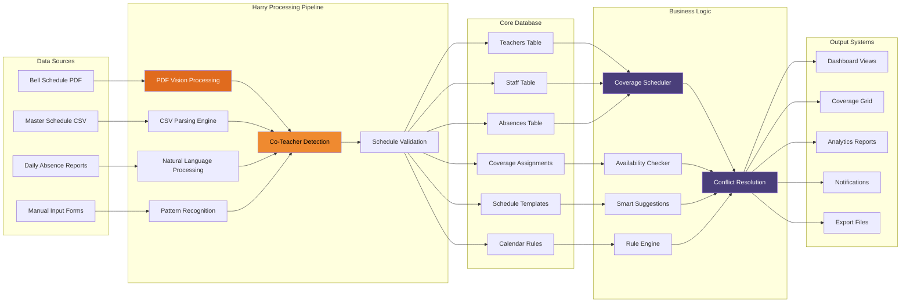

# Harry Llama Scheduler - Data Flow Architecture

**Target Audience:** IT Department  
**Purpose:** Data movement and processing pipeline throughout the system

This diagram illustrates how data flows through the Harry Llama Scheduler system, from initial input sources through Harry's processing pipeline to final output systems. Understanding this flow is crucial for system maintenance, troubleshooting, and optimization.

## Data Flow Overview

The system processes data through five main stages:

1. **Data Sources:** Various input formats and channels
2. **Harry Processing Pipeline:** Intelligent analysis and transformation
3. **Core Database:** Centralized data storage and relationships
4. **Business Logic:** Decision-making and optimization algorithms
5. **Output Systems:** User interfaces and reporting mechanisms

## Mermaid Diagram



## Data Source Details

### Bell Schedule PDF Processing
- **Input Format:** PDF documents with bell schedule tables
- **Processing Method:** GPT-4 Vision for table extraction
- **Data Extracted:** Period names, start/end times, days of week
- **Validation:** Automatic format verification and manual review option
- **Output:** Structured schedule templates ready for database storage

### Master Schedule CSV Analysis
- **Input Format:** Comma-separated values from SIS exports
- **Processing Method:** Intelligent CSV parsing with column detection
- **Data Extracted:** Teacher assignments, room numbers, period mappings
- **Special Features:** Co-teacher relationship detection through pattern analysis
- **Output:** Complete teacher schedule matrix with relationships

### Daily Absence Reports  
- **Input Formats:** PDF reports, email notifications, web forms
- **Processing Method:** Natural language processing and text extraction
- **Data Extracted:** Teacher names, absence dates, substitute assignments
- **Smart Matching:** Fuzzy name matching against teacher database
- **Output:** Structured absence records ready for coverage assignment

### Manual Input Forms
- **Input Sources:** Web forms, administrative overrides, corrections
- **Processing Method:** Direct database insertion with validation
- **Data Types:** Teacher information, schedule corrections, calendar events
- **Validation:** Real-time form validation and constraint checking
- **Output:** Verified data records integrated with existing information

## Harry Processing Pipeline Details

### PDF Vision Processing (`ai_parsing.py`)
```python
# Core technology: OpenAI GPT-4 Vision
# Capabilities: Table recognition, text extraction, format interpretation
# Accuracy: 95%+ for standard school schedule formats
# Fallback: Manual template entry for complex layouts
```

### CSV Parsing Engine
```python
# Features: Automatic column detection, data type inference
# Co-teacher Detection: Pattern matching and enrollment analysis
# Validation: Cross-reference checks, completeness verification
# Error Handling: Graceful failure with detailed error reporting
```

### Natural Language Processing
```python
# Absence Report Analysis: Teacher name extraction, date parsing
# Smart Name Matching: Fuzzy matching algorithms, nickname handling
# Context Understanding: Substitute preferences, special instructions
# Integration: Direct database updates with conflict resolution
```

## Database Schema Relationships

### Core Relationships
```sql
Teachers (1) ←→ (Many) Absences
Absences (1) ←→ (Many) CoverageAssignments  
Teachers (Many) ←→ (Many) Teachers (Co-teaching)
ScheduleTemplates (1) ←→ (Many) TeacherSchedules
CalendarRules (Many) ←→ (Many) ScheduleTemplates
```

### Data Integrity Constraints
- Foreign key relationships maintain referential integrity
- Unique constraints prevent duplicate assignments
- Check constraints validate data ranges and formats
- Trigger functions maintain audit trails

## Business Logic Processing

### Coverage Scheduler Algorithm
1. **Priority Analysis:** Evaluate coverage options by tier priority
2. **Availability Check:** Verify teacher schedules and preparation periods  
3. **Qualification Matching:** Match subject areas and certifications
4. **Workload Balancing:** Distribute coverage assignments fairly
5. **Conflict Resolution:** Handle scheduling conflicts automatically

### Smart Suggestions Engine
- **Historical Analysis:** Learn from successful past assignments
- **Pattern Recognition:** Identify optimal coverage combinations
- **Predictive Modeling:** Anticipate future coverage needs
- **Continuous Learning:** Improve recommendations over time

### Rule Engine Configuration
- **Configurable Constraints:** Administrative policies and procedures
- **Priority Rules:** Coverage assignment preferences and hierarchy
- **Exception Handling:** Special cases and emergency procedures
- **Audit Compliance:** Maintain records for regulatory requirements

## Output System Integration

### Dashboard Views
- **Real-time Updates:** WebSocket connections for live data
- **Responsive Design:** Mobile-friendly administrative interface
- **Role-based Access:** Customized views for different user types
- **Interactive Elements:** Drag-and-drop coverage assignment

### Analytics Reports
- **Data Aggregation:** Statistical analysis of coverage patterns
- **Trend Analysis:** Historical data visualization and insights
- **Export Capabilities:** PDF, Excel, and CSV format options
- **Automated Scheduling:** Daily, weekly, and monthly report generation

### Notification Systems
- **Multi-channel Delivery:** Email, SMS, push notifications, in-app alerts
- **Template Management:** Customizable message templates
- **Delivery Tracking:** Confirmation and read receipt monitoring
- **Escalation Procedures:** Automatic escalation for critical situations

## Performance Optimization

### Database Optimization
- **Indexed Queries:** Strategic indexing for frequently accessed data
- **Query Optimization:** Efficient JOIN operations and subqueries
- **Connection Pooling:** Managed database connections
- **Caching Strategy:** Redis cache for frequently accessed static data

### Processing Optimization  
- **Asynchronous Processing:** Background tasks for time-intensive operations
- **Batch Processing:** Efficient handling of large data sets
- **API Rate Limiting:** Respectful usage of external services
- **Error Recovery:** Automatic retry mechanisms for transient failures

## Monitoring and Troubleshooting

### Data Flow Monitoring
- **Processing Metrics:** Success rates, processing times, error rates
- **Data Quality Metrics:** Accuracy, completeness, consistency measures
- **System Health Monitoring:** Database performance, API response times
- **Alert Systems:** Proactive notification of system issues

### Troubleshooting Tools
- **Logging Framework:** Comprehensive logging at all processing stages
- **Data Validation Reports:** Detailed error analysis and correction suggestions
- **Processing Pipeline Visibility:** Step-by-step processing status tracking
- **Recovery Procedures:** Standard procedures for data restoration and correction