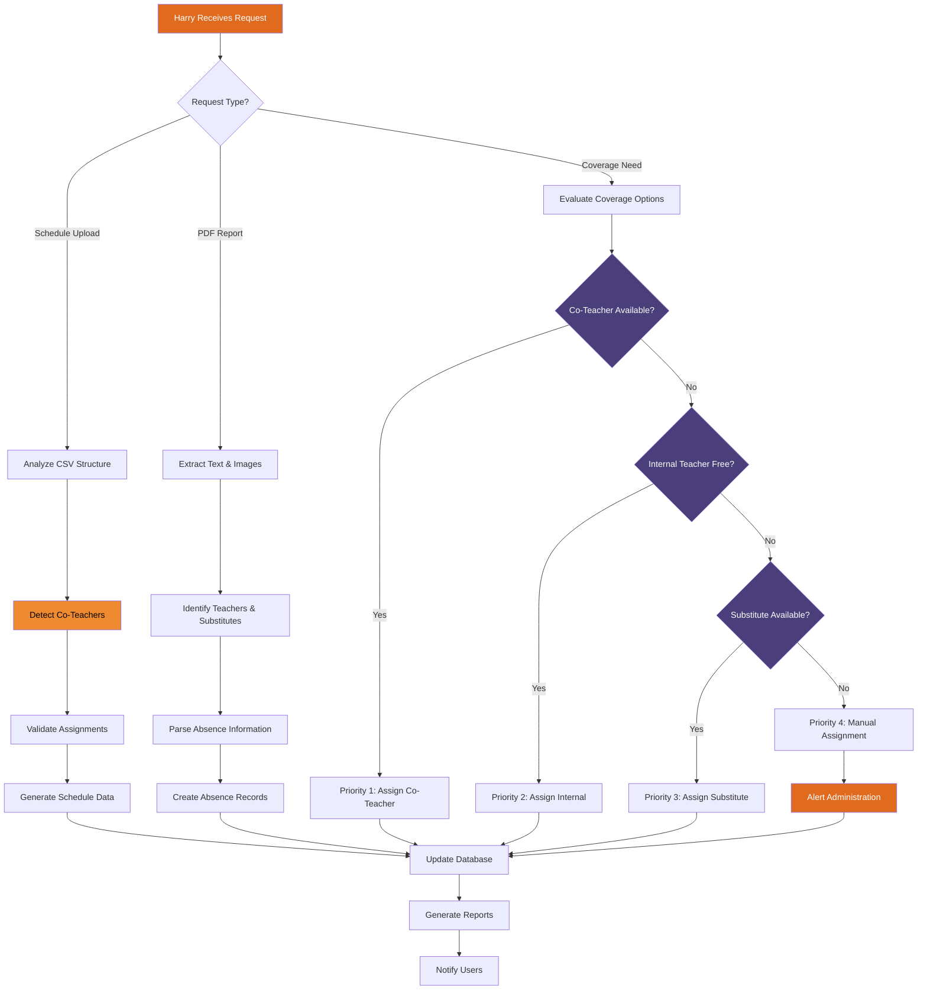

# Harry Llama Scheduler - Harry Intelligence Decision Tree

**Target Audience:** Principals, Assistant Principals & IT Department  
**Purpose:** Understanding Harry's decision-making process and intelligent automation

This diagram illustrates how Harry, the intelligent core of the scheduling system, processes different types of requests and makes decisions. Understanding Harry's logic helps both educational leaders and technical staff optimize system performance and troubleshoot issues.

## Decision Process Overview

Harry's intelligence operates through a sophisticated decision tree that handles three primary request types:

1. **Schedule Upload Processing** - Master schedule CSV analysis and co-teacher detection
2. **PDF Report Analysis** - Vision-based document processing for absence reports
3. **Coverage Assignment** - Intelligent matching of coverage needs with available resources

Each path through the decision tree includes validation, error handling, and feedback loops to ensure optimal outcomes.

## Mermaid Diagram



## Harry's Decision-Making Algorithms

### Schedule Upload Processing (`ai_parsing.py`)

**Step 1: CSV Structure Analysis**
```python
# Intelligent column detection and mapping
# Handles various CSV formats from different SIS systems
# Identifies teacher names, periods, subjects, room assignments
# Error recovery for malformed or non-standard formats
```

**Step 2: Co-Teacher Detection Algorithm**
Harry uses multiple detection methods with confidence scoring:

- **Exact Matches (100% confidence):** Identical course entries across multiple teachers
- **Fuzzy Matches (80-90% confidence):** Similar courses with minor variations  
- **Keyword Detection (60-75% confidence):** "co-taught", "team taught", "with", etc.
- **Enrollment Analysis (70-85% confidence):** Split enrollment patterns indicating shared classes

**Step 3: Assignment Validation**
- Cross-reference against master teacher database
- Verify period structure compatibility
- Check for scheduling conflicts and impossibilities
- Validate subject-teacher qualifications where possible

### PDF Report Analysis (`parse_report_with_ai_vision`)

**Step 1: Vision Processing**
Harry uses OpenAI's GPT-4 Vision to:
- Extract text from PDF documents regardless of format
- Identify table structures and layout patterns
- Process scanned documents and image-based PDFs
- Handle handwritten notes and annotations

**Step 2: Teacher & Substitute Identification**
```python
# Smart name matching algorithm
# Handles nicknames, abbreviations, and name variations
# Cross-references against existing teacher database
# Identifies substitute teacher assignments and preferences
```

**Step 3: Absence Information Parsing**
- Extract absence dates and duration
- Identify specific periods affected
- Parse special instructions or requirements
- Detect recurring absence patterns

### Coverage Assignment Intelligence (`coverage_scheduler.py`)

**Priority 1: Co-Teacher Assignment**
- Availability verification during affected periods
- Subject matter expertise confirmation
- Student relationship continuity assessment
- Workload impact evaluation

**Priority 2: Internal Teacher Assignment**  
- Preparation period availability analysis
- Subject compatibility scoring
- Previous coverage performance history
- Fair distribution algorithm

**Priority 3: External Substitute Assignment**
- Substitute pool availability check  
- Certification and qualification matching
- Historical performance evaluation
- Geographic and timing preferences

**Priority 4: Manual Assignment Escalation**
- Administrative alert generation
- Context and options summary
- Escalation timeline management
- Resolution tracking and follow-up

## Harry's Learning Capabilities

### Pattern Recognition
- **Historical Success Analysis:** Learns from successful coverage assignments
- **Failure Pattern Avoidance:** Identifies and avoids problematic combinations
- **Seasonal Adjustments:** Adapts to recurring patterns (flu season, testing periods)
- **School-Specific Learning:** Customizes behavior based on individual school characteristics

### Continuous Improvement
- **Feedback Integration:** Incorporates administrative feedback on decisions
- **Performance Metrics:** Tracks success rates and optimization opportunities
- **Algorithm Refinement:** Updates decision weights based on outcomes
- **Predictive Enhancement:** Improves prediction accuracy over time

## Error Handling and Edge Cases

### Data Quality Issues
- **Missing Information:** Intelligent gap-filling with confidence scoring
- **Contradictory Data:** Conflict resolution with administrative escalation
- **Format Variations:** Adaptive parsing for non-standard inputs
- **Incomplete Records:** Graceful degradation with partial processing

### Complex Scenarios
- **Multiple Simultaneous Absences:** Optimized assignment across all needs
- **Cascade Coverage Effects:** Managing knock-on effects of assignments
- **Last-Minute Changes:** Real-time re-optimization capabilities  
- **Emergency Situations:** Rapid-response protocols with manual override

### System Integration Challenges
- **External System Failures:** Graceful fallback procedures
- **Network Connectivity Issues:** Offline mode capabilities
- **API Rate Limiting:** Intelligent request management
- **Data Synchronization:** Conflict resolution across multiple data sources

## Administrative Controls

### Configuration Options
- **Priority Weights:** Customizable scoring for coverage options
- **Constraint Rules:** School-specific policies and procedures
- **Escalation Thresholds:** When to require manual intervention
- **Notification Preferences:** Customizable alert and communication settings

### Override Capabilities
- **Manual Decision Override:** Administrative control over Harry's recommendations
- **Rule Exceptions:** Temporary or permanent policy exceptions
- **Emergency Protocols:** Special handling for critical situations
- **Audit Trail:** Complete record of all decisions and overrides

## Performance Metrics

### Decision Accuracy
- **Coverage Success Rate:** Percentage of successful coverage assignments
- **Prediction Accuracy:** How often Harry's recommendations are accepted
- **Error Reduction:** Decrease in manual corrections over time
- **User Satisfaction:** Feedback scores from administrators and teachers

### Processing Efficiency
- **Response Time:** Average processing time for different request types
- **Throughput:** Number of requests processed per unit time
- **Resource Utilization:** System resource consumption optimization
- **Scalability Metrics:** Performance under increasing load

Harry's intelligent decision-making process represents the culmination of advanced natural language processing, pattern recognition, and educational domain expertise. The system continuously learns and improves, making it increasingly valuable as a strategic tool for educational administration.