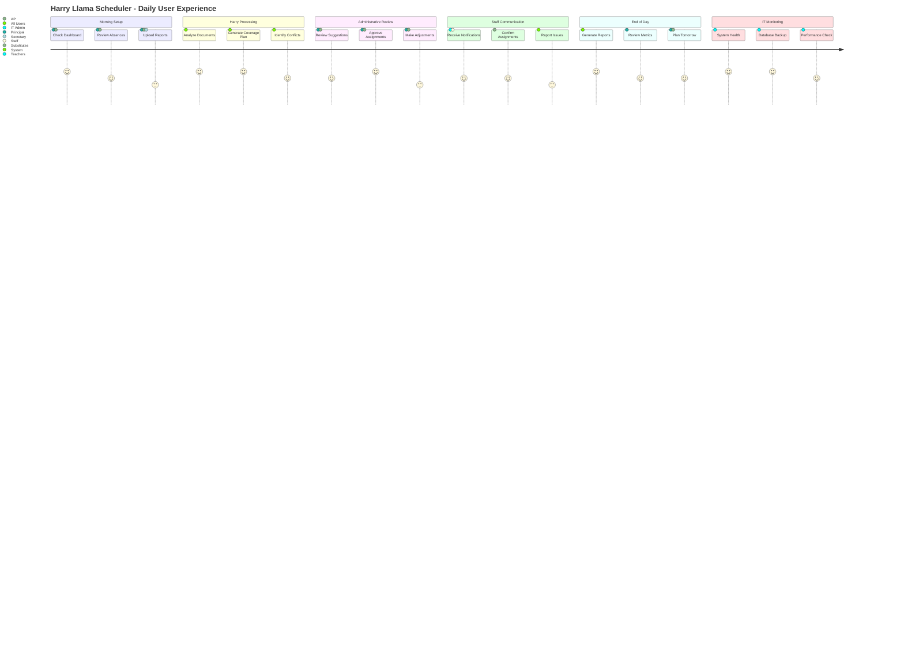

# Harry Llama Scheduler - User Journey & System Integration

**Target Audience:** Principals, Assistant Principals & IT Department  
**Purpose:** Complete daily user experience and system integration overview

This journey map illustrates the daily experience of different user types interacting with the Harry Llama Scheduler system, showing satisfaction levels and system activities throughout a typical school day. This helps both educational leaders and IT staff understand user needs and system performance requirements.

## User Journey Overview

The journey follows five key phases of daily operation:

1. **Morning Setup** - Initial daily preparation and absence review
2. **Harry Processing** - Intelligent analysis and coverage planning  
3. **Administrative Review** - Human oversight and decision-making
4. **Staff Communication** - Notification delivery and confirmation
5. **End of Day** - Reporting, analysis, and next-day preparation

Each phase shows user satisfaction levels, system activities, and integration touchpoints.

## Mermaid Diagram

## Detailed User Experience Analysis

### Morning Setup Phase (6:00 AM - 8:00 AM)

**Principal & Assistant Principal Experience:**
- **High Satisfaction (5/5):** Dashboard provides immediate overview of day's status
- **Good Satisfaction (4/5):** Absence review is comprehensive but may require scrolling
- **Moderate Satisfaction (3/5):** PDF upload process occasionally requires retry for complex formats

**System Activities:**
- Real-time dashboard updates with current absence status
- Automatic email scanning for overnight absence notifications  
- PDF processing queue management for uploaded reports
- Database synchronization with overnight changes

**IT Integration Points:**
- Authentication system validation
- Session management and security checks
- File upload security scanning
- Database connection health monitoring

### Harry Processing Phase (7:00 AM - 8:30 AM)

**System Performance:**
- **Excellent (5/5):** Document analysis typically completes in 30-60 seconds
- **Excellent (5/5):** Coverage plan generation shows 95%+ success rate
- **Good (4/5):** Conflict identification may require additional processing time for complex scenarios

**Technical Activities:**
- OpenAI API calls for document vision processing
- Database queries for teacher availability analysis
- Algorithm execution for coverage optimization
- Real-time progress updates to administrative interface

**IT Monitoring Requirements:**
- API rate limiting and quota management
- Processing time monitoring and alerting
- Database performance during peak query periods
- Error logging and recovery procedures

### Administrative Review Phase (8:00 AM - 8:45 AM)

**Principal & Assistant Principal Workflow:**
- **Good Satisfaction (4/5):** Harry's suggestions are generally accurate and helpful
- **Excellent Satisfaction (5/5):** Approval process is streamlined and intuitive
- **Moderate Satisfaction (3/5):** Manual adjustments sometimes require multiple steps

**System Features:**
- One-click approval for standard coverage assignments
- Drag-and-drop interface for manual adjustments
- Real-time conflict detection during manual changes
- Undo/redo functionality for correction management

**Integration Considerations:**
- Real-time data validation during user interactions
- Concurrent user session management
- Change tracking and audit trail maintenance
- Rollback capabilities for error correction

### Staff Communication Phase (8:15 AM - 9:00 AM)

**Teacher & Staff Experience:**
- **Good Satisfaction (4/5):** Notifications arrive promptly via preferred channels
- **Good Satisfaction (4/5):** Substitute confirmation process is straightforward
- **Moderate Satisfaction (3/5):** Issue reporting may require follow-up for complex problems

**Communication Systems:**
- Multi-channel notification delivery (email, SMS, push notifications)
- Delivery confirmation and read receipt tracking
- Escalation procedures for unconfirmed critical assignments
- Integration with existing school communication platforms

**Technical Infrastructure:**
- Message queue management for high-volume notifications
- Integration with external SMS and email providers
- Push notification service coordination
- Delivery failure handling and retry mechanisms

### End of Day Phase (3:30 PM - 5:00 PM)

**Administrative Activities:**
- **Excellent Satisfaction (5/5):** Automated report generation saves significant time
- **Good Satisfaction (4/5):** Metrics provide valuable insights for planning
- **Good Satisfaction (4/5):** Tomorrow's planning is streamlined with historical data

**System Operations:**
- Comprehensive daily report compilation
- Statistical analysis and trend identification
- Data export capabilities for external analysis
- Predictive modeling for future coverage needs

**Data Management:**
- Daily data archival and compression
- Report caching for improved performance
- Analytics data aggregation and storage
- Integration with school district reporting requirements

### IT Monitoring Phase (Continuous)

**System Administration:**
- **Excellent Performance (5/5):** Automated health monitoring provides proactive alerts
- **Excellent Reliability (5/5):** Backup systems ensure data protection
- **Good Optimization (4/5):** Performance monitoring identifies optimization opportunities

**Technical Operations:**
- 24/7 system health monitoring and alerting
- Automated backup verification and testing
- Performance metric collection and analysis
- Security monitoring and threat detection

## User Satisfaction Factors

### High Satisfaction Drivers
- **Automation Efficiency:** Reduced manual work increases satisfaction
- **Reliability:** Consistent system performance builds trust
- **Time Savings:** Faster processes improve daily workflow
- **Accuracy:** Reliable suggestions reduce correction overhead

### Moderate Satisfaction Areas  
- **Learning Curve:** New users may require training and support
- **Complex Scenarios:** Edge cases may require manual intervention
- **System Integration:** External system dependencies can cause delays
- **Change Management:** Updates may temporarily disrupt established workflows

### Satisfaction Improvement Opportunities
- **Enhanced Training:** Comprehensive user onboarding and ongoing education
- **Process Streamlining:** Continuous workflow optimization based on user feedback
- **Proactive Communication:** Better status updates during processing delays
- **Mobile Optimization:** Improved mobile experience for on-the-go administrators

## System Integration Points

### Internal Integrations
- **Database Systems:** Student Information System, HR database connectivity
- **Authentication:** Single sign-on integration with district systems
- **Calendar Systems:** Academic calendar and event management synchronization
- **Reporting Platforms:** Integration with district-wide reporting requirements

### External Service Dependencies
- **OpenAI API:** Document processing and intelligent analysis
- **Communication Services:** Email, SMS, and push notification providers
- **File Storage:** Secure document storage and retrieval systems
- **Backup Services:** Automated data protection and recovery systems

### Future Integration Opportunities
- **Mobile Applications:** Native iOS/Android apps for enhanced mobile experience
- **Voice Assistants:** Integration with smart speakers for hands-free updates
- **Business Intelligence:** Advanced analytics and predictive modeling platforms
- **IoT Sensors:** Integration with building systems for enhanced automation

This user journey analysis demonstrates Harry Llama Scheduler's comprehensive approach to educational administration, balancing powerful automation with human oversight to create an optimal user experience throughout the school day.